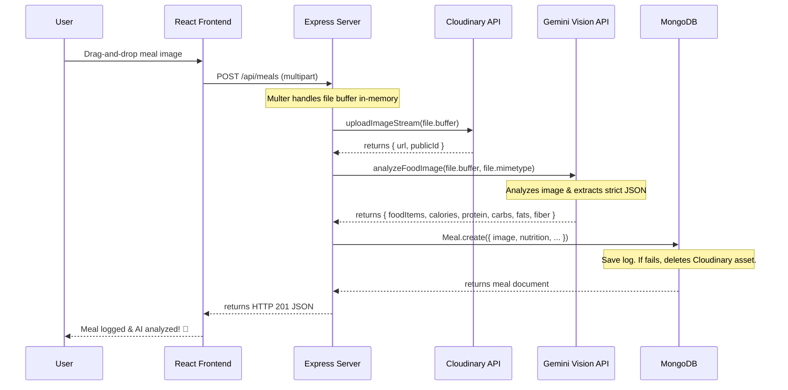

# NutriLens AI — Computer Vision Food & Nutrition Tracker

NutriLens AI is a full-stack MERN application that uses Google Gemini Vision to analyze food photographs and track daily nutrition. Users can take a picture of their plate to automatically identify ingredients, estimate serving sizes, and log macronutrients against custom daily goals.

---

## 🚀 Key Features

*   **AI Food Analysis:** Leverages Google Gemini Vision (`gemini-2.0-flash`) to estimate calories, protein, carbs, fats, and fiber from food images.
*   **Dynamic Dashboard:** Real-time progress tracker comparing daily intake against targets calculated via physical metrics (BMR & TDEE).
*   **Nutrition Insights Card:** A deterministic rules-based feedback engine generating instant score averages, warnings (e.g., calorie/fat excesses), and diet improvements.
*   **Calendar History & Filtering:** Interactive date-range selectors and preset filters to look up historic meals grouped chronologically with daily totals.
*   **Robust Image Storage:** Direct memory buffer streaming to Cloudinary, complete with transaction compensation (image rollback on database save failures).
*   **Production-Grade Authentication:** JWT tokens with sliding access windows and refresh token rotation handled automatically via Axios interceptors.

---

## 🛠️ Technology Stack

| Layer | Technologies |
|---|---|
| **Frontend** | React, Vite, Zustand (State Management), Tailwind CSS, Lucide Icons |
| **Backend** | Node.js, Express, MongoDB, Mongoose, Multer (Memory Storage) |
| **Integrations** | Google Gemini Vision API, Cloudinary (Image Hosting) |
| **Security** | JSON Web Tokens (JWT), Express Rate Limit, Helmet, BcryptJS, Zod (Schema Validation) |

---

## 📐 Architecture & Data Flow



---

## 📑 API Catalog Overview

### 🔐 Authentication (`/api/auth/*`)
*   `POST /register` — Register a new account + physical metrics
*   `POST /login` — Authenticate user & issue token pair
*   `POST /refresh` — Renew access token using sliding refresh window
*   `POST /logout` — Invalidate refresh token
*   `GET /me` — Get user profile details & goals
*   `PUT /me` — Update physical metrics (re-calculates TDEE/BMR)
*   `PUT /me/password` — Update user credentials
*   `PUT /me/goals` — Custom goals overriding Mifflin-St Jeor calculations

### 🥗 Meals (`/api/meals/*`)
*   `POST /` — Log new meal with image upload (trigger Gemini AI)
*   `GET /` — Get paginated, filtered meals (supports `page`, `limit`, `mealType`, and `date` queries)
*   `GET /daily-summary` — Nutrition sums for a specific date
*   `GET /history` — Fetch grouped historic meals by date range
*   `GET /:id` — Get single meal details
*   `PUT /:id` — Update meal notes, type, or image (re-run AI analysis if image changes)
*   `DELETE /:id` — Delete meal (triggers DB removal and Cloudinary purge)

### 📊 Dashboard & Insights
*   `GET /api/dashboard/today` — Aggregate today's totals and log feed
*   `GET /api/insights` — Calculate deterministic nutrition scores, warnings, and suggestions

---

## 💻 Installation & Local Setup

### Prerequisites
*   Node.js (v18+)
*   MongoDB (running locally or Atlas instance)
*   Google Gemini API Key
*   Cloudinary Account

### 1. Clone & Install Dependencies
```bash
# Clone the repository
git clone https://github.com/your-username/NutriLens.git
cd NutriLens

# Install backend dependencies
cd server
npm install

# Install frontend dependencies
cd ../client
npm install
```

### 2. Configure Environment Variables
Create a `.env` file in the `server` directory matching [.env.example](.env.example):
```env
PORT=5000
NODE_ENV=development
MONGODB_URI=mongodb://127.0.0.1:27017/nutrilens
JWT_ACCESS_SECRET=your_super_secret_access_key
JWT_REFRESH_SECRET=your_super_secret_refresh_key
GEMINI_API_KEY=your_gemini_vision_key
CLOUDINARY_CLOUD_NAME=your_cloudinary_name
CLOUDINARY_API_KEY=your_cloudinary_key
CLOUDINARY_API_SECRET=your_cloudinary_secret
CLIENT_URL=http://localhost:5173
```

Create a `.env` file in the `client` directory:
```env
VITE_API_URL=http://localhost:5000/api
```

### 3. Seed Mock Database
Populate your local database with a test user (`test@nutrilens.com` / password `Password123!`) containing a continuous 30-day history (120 meals, 4 meals per day) to test charts, calendar filtering, and progress gauges:
```bash
cd server
npm run seed
```
*Note: This command clears existing user and meal collections in the target database before seeding.*

### 4. Run Development Servers
```bash
# Start backend server (listening on port 5000)
cd server
npm run dev

# Start Vite client dev server (listening on port 5173)
cd ../client
npm run dev
```

---

## 🛡️ Production Deployment Guide

### Database (MongoDB Atlas)
1.  Create a cluster on MongoDB Atlas.
2.  Whitelist IP addresses (`0.0.0.0/` for Vercel/Render).
3.  Copy the connection string and replace `MONGODB_URI` in server environment configs.

### Backend (Render/Railway/Heroku)
1.  Connect your backend repository to Render as a **Web Service**.
2.  Set the **Build Command** to `npm install` and **Start Command** to `npm start` (inside the `server` directory).
3.  Inject all keys into Environment Variables, ensuring `NODE_ENV` is set to `production` and `CLIENT_URL` points to your Vercel deployment.

### Frontend (Vercel)
1.  Create a project on Vercel and link the repository.
2.  Set Root Directory to `client`.
3.  Add `VITE_API_URL` pointing to your hosted backend service (e.g., `https://nutrilens-api.onrender.com/api`).
4.  Deploy.

---

## 📈 Engineering Metrics (Resume Bullet Items)
*   **AI Integration & Resilience:** Integrated Google Gemini Vision APIs to analyze food photos, reducing log entry times from 2 minutes down to under 15 seconds. Built 3-stage JSON parser fallbacks ensuring graceful recovery (zeroed default macro logging) on AI API downtime.
*   **Compensating Transactions:** Designed database-save validation pipelines using Multer in-memory streaming, guaranteeing automatic deletion of Cloudinary media assets on MongoDB database write failure.
*   **Scale Testing:** Engineered a seeding utility generating 1,000+ realistic meal records across 100 mock profiles to stress-test chronological date-range filtering, timeline aggregation algorithms, and paginated searches.
